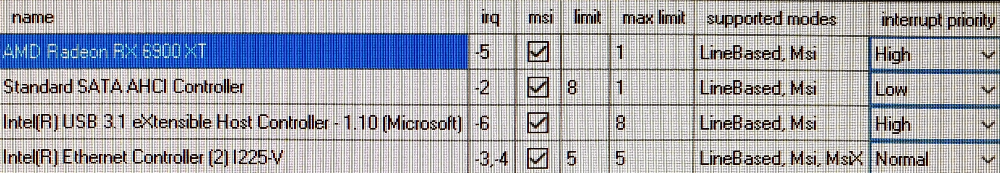

# In-depth-Windows-tweaking

This guide covers tweaks beyond "advanced" PC optimization, focusing on both hardware and software. Most standard tweaks such as basic BIOS and Windows settings are widely documented, so they’re not included here. Most advanced tweaks are in my `.bat` files:<br>
https://github.com/Hyyote/files-/tree/main/Windows%2010<br>
https://github.com/Hyyote/files-/tree/main/Windows%2011

> **Note:** If you require components for games like Valorant or FACEIT, or need Windows Update support, this guide is not for you.

---

## 1. The Operating System (ranting, feel free to skip)

Linux isn't suitable for competitive gaming because tweaks don't go as deep as the ones you can do in Windows. Distros are similar in latency and input feel, which I found to be subpar compared to any version of Windows.

I used to recommend Windows 7 and Windows 10 1803 specifically, but I have to admit that later versions are superior only because of perceived stability, higher performance and better software compatibility at the moment, but all of them have higher idle latency. I don't find much difference between Windows 10 22H2 and Windows 11 23H2/24H2.<br>

Windows 11 always used to feel smoother on the desktop but when I ran tests and played games, the two felt identical.<br>

Windows 10 is more resilient when it comes to tweaks and it can be stripped down to its bones without sacrificing any functionality (22 services running), while Windows 11 needs UWP app support, StateRepository, DWM and many other things running to ensure nothing breaks and can be taken down to around 31 services.

---

## 2. Windows Tweaks

First, install a version of Windows you like, it can be a stock install or a custom one, however I really dislike having a lot of things running in the background in the first place,
so I recommend one that is pre-tweaked such as my NTLite builds or Tiny11.

Install Windows without internet connection until you ensure all the update services and automatic driver updates are disabled.

Disable audio enhancements in the sound control panel.

**Import a power plan**:
   - [My custom plan (idle disabled by default)](https://github.com/Hyyote/files-/blob/main/Hyote.pow)
   - Bitsum Highest Performance
   - [Zoyata's power plan](https://github.com/IDIVASM/POWERPLAN-WINDOWS-10-)

Use AppxPackagesManager to clean up apps you don't need.

<br>

**Autoruns**: unhide Windows services

   - services: disable AppXSvc, ApxSvc, BITS, Bluetooth related, FontCache, UDK related, WMI, Wpn services

   - drivers: disable AppleSSD, Bluetooth related, HidBatt, HidBth, Intel Serial IO related, Microsoft_Bluetooth, WacomPen

<br>

**BCDEdits**: there are ongoing debates about which is the right configuration for each version of Windows, but in my experience, the legacy settings provided the best results.
   ```batch
bcdedit /set nx AlwaysOff
bcdedit /set ems No
bcdedit /set bootems No
bcdedit /set integrityservices disable
bcdedit /set tpmbootentropy ForceDisable
bcdedit /set bootmenupolicy Legacy
bcdedit /set debug No
bcdedit /set disableelamdrivers Yes
bcdedit /set isolatedcontext No
bcdedit /set allowedinmemorysettings 0x0
bcdedit /set vm NO
bcdedit /set vsmlaunchtype Off
bcdedit /set configaccesspolicy Default
bcdedit /set MSI Default
bcdedit /set usephysicaldestination No
bcdedit /set usefirmwarepcisettings No
bcdedit /set sos no
bcdedit /set pae ForceDisable
bcdedit /set tscsyncpolicy legacy
bcdedit /set hypervisorlaunchtype off
bcdedit /set useplatformclock false
bcdedit /set useplatformtick no
bcdedit /set disabledynamictick yes
bcdedit /set x2apicpolicy disable
bcdedit /set uselegacyapicmode yes
```
Device Manager:
View -> Devices by type<br>
In the Disk drives category, uncheck write caching the Properties -> Policies section<br>

Disable power saving on every device with a script or manually, since it takes around one minute to do.

Disable unnecessary devices: (System Management BIOS, PCI Express Root Ports, ISA Bridge, PCI standard RAM Controller, generic software components, unused usb devices, generic pnp monitor)
Show hidden devices, disable Motherboard resources

A properly broken device manager after Windows and SCEWIN BIOS tweaks should look like this:


<br>

**MSI Utility V3**

They say this one shouldn't be touched as modern systems have MSI Mode set correctly for every device, however I found some gains in setting them manually.<br>
This configuration can cause stuttering in some games:<br>
check MSI Mode on every device, GPU High, SATA Low, USB High, NIC Normal<br>

<br>



<br>

**Interrupt Affinities**

I played around a lot with this one, and I didn't come to a conclusion. For consistency I recommend not setting affinities, but for a more stable Mouse Polling graph and possibly better mouse feel, I set my USB Host Controller to a separate core.

---

## 2.5. Poorly documented tweaks


I won't claim these to make a world of a difference or even make directly positive changes to your system, but I find them very important.

<br>

**Disable Task Manager and Control Panel**

Not having something running in the background is always good. Your system could freeze for many possible reasons while you're playing games or doing something important, but realistically you almost never need to use these.

I recommend not replacing Task Manager with either ProcessExplorer or SystemInformer (ProcessHacker) because both are sources of input lag. Using them portably is completely fine.

These settings can be turned on and off, but you need to restart for the Control Panel to turn back on.

```cmd
REG ADD "HKCU\Software\Microsoft\Windows\CurrentVersion\Policies\System" /v "DisableTaskMgr" /t Reg_DWORD /d "1" /f
REG ADD "HKCU\Software\Microsoft\Windows\CurrentVersion\Policies\Explorer" /v "NoControlPanel" /t Reg_DWORD /d "1" /f
```
<br>
<br>

**Delete ICC Color Profiles**

This can only be done with System Privileges, so it's best to use NSudo or something similar.<br>
colorcpl -> All Profiles -> delete everything under ICC Profiles

<br>
<br>

**Disable DWM**

https://github.com/Hyyote/files-/tree/main/DWM

Depending on whether you use Windows 10 or 11 there are two ways to do this.
If you are on Windows 11, you cannot restart with DWM disabled, because many things like the desktop and mouse will break.

You can run the DWM disable script after startup and enable it back again before shutting down.
If you accidentally restart with DWM disabled you can still open the explorer with Ctrl+E and navigate to your script using the keyboard.

<br>
<br>

**Display scaling and custom resolutions**

It's generally recommended to use display scaling and native resolutions.
However Windows complicates things with an additional setting that needs to be changed in order to really use display scaling:

in regedit, go to HKLM\SYSTEM\ControlSet001\Control\GraphicsDrivers\Configuration\<DisplayID>\00\00<br>

change Scaling to 0

   - 1: Identity scaling
   - 2: No scaling
   - 3: Full-screen
   - 4: Aspect ratio

Even though 2 is the value for no scaling, 0 seems to disable it completely, but this is just speculation.

<br>

As for Custom Resolution Utility, I recommend deleting every value and adding resolutions to the Detailed Resolutions tab, using Exact Reduced timings with the monitor's highest supported refresh rate.


<br>

**Device Cleanup**

This one is hugely overlooked. There are only benefits to cleaning up unused entries if you don't use multiple devices that rely on Windows settings instead of onboard memory.

You can bulk remove them with: https://www.uwe-sieber.de/files/DeviceCleanup_x64.zip (use at your own risk, since the tool isn't open source)
