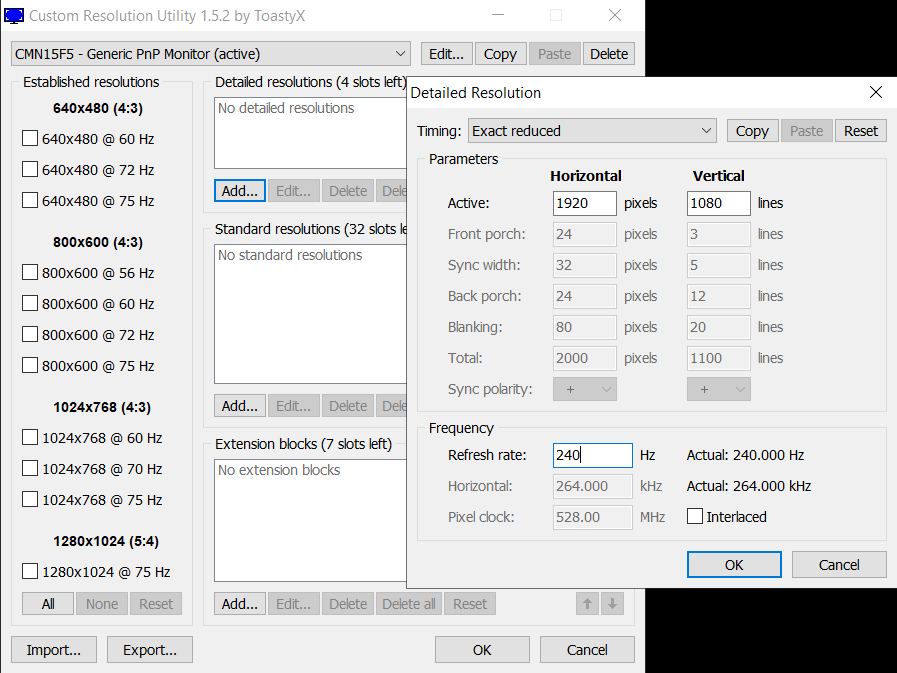

# In-depth-Windows-tweaking

This guide covers tweaks beyond "advanced" PC optimization focusing on Windows settings that are more on the experimental side. Basic BIOS and Windows settings are widely documented, so they’re not included here. Most advanced tweaks are in my `.bat` files:<br>

you can search for things you are interested in by searching for keywords like Privacy, Telemetry, CoreParking, Kernel settings, while undefined ones are in Miscellaneous

&nbsp;&nbsp;&nbsp;https://github.com/Hyyote/files-/tree/main/tweaks

> **Note:** If you require components for games like Valorant or FACEIT, or need Windows Update support, this guide is not for you.

---

## 1. The Operating System (ranting, feel free to skip)

   - Linux isn't suitable for competitive gaming because tweaks don't go as deep as the ones you can do in Windows. Distros are similar in latency and input feel, which I found to be subpar compared to any version of Windows.

   - I used to recommend Windows 7 and Windows 10 1803 specifically, but I have to admit that later versions are superior only because of perceived stability, higher performance and better software compatibility at the moment, but all of them have higher idle latency. I don't find much difference between Windows 10 22H2 and Windows 11 23H2/24H2.<br>

   - Windows 11 always used to feel smoother on the desktop but when I ran tests and played games, the two felt identical.<br>

   - Windows 10 is more resilient when it comes to tweaks and it can be stripped down to its bones without sacrificing any functionality (22 services running), while Windows 11 needs UWP app support, StateRepository, DWM and many other things running to ensure nothing breaks and can be taken down to around 31 services.

---

## 2. Windows Tweaks

   - First, install a version of Windows you like, it can be a stock install or a custom one, however I really dislike having a lot of things running in the background in the first place,
so I recommend one that is pre-tweaked such as my NTLite builds or Tiny11.

   - Install Windows without internet connection until you ensure all the update services and automatic driver updates are disabled.

   - Disable audio enhancements in the sound control panel.
<br>

**Import a power plan**<br>

Recommendations:
   - [BEYOND PERFORMANCE](https://github.com/Hyyote/files-/blob/main/Power%20plans/beyond.pow)
   - [Lawliet](https://github.com/Hyyote/files-/blob/main/Power%20plans/lawliet.pow)
   - [Sapphire](https://github.com/Hyyote/files-/blob/main/Power%20plans/sapphire.pow)
<br>

Use AppxPackagesManager to clean up apps you don't need.


<br>

**Autoruns**: unhide Windows services

   - services: disable AppXSvc, ApxSvc, BITS, Bluetooth related, FontCache, UDK related, WMI, Wpn services

   - drivers: disable AppleSSD, Bluetooth related, HidBatt, HidBth, Intel Serial IO related, Microsoft_Bluetooth, swenum, WacomPen

<br>

**BCDEdits**: (default values recommended for Windows 11) there are ongoing debates about which is the right configuration for each version of Windows, but in my experience, the legacy settings provided the best results.
   ```batch
BCDEDIT /set nx AlwaysOff >NUL 2>&1
BCDEDIT /set ems No >NUL 2>&1
BCDEDIT /set bootems No >NUL 2>&1
BCDEDIT /set integrityservices disable >NUL 2>&1
BCDEDIT /set tpmbootentropy ForceDisable >NUL 2>&1
BCDEDIT /set bootmenupolicy Legacy >NUL 2>&1
BCDEDIT /set debug No >NUL 2>&1
BCDEDIT /set hypervisorlaunchtype Off >NUL 2>&1
BCDEDIT /set disableelamdrivers Yes >NUL 2>&1
BCDEDIT /set isolatedcontext No >NUL 2>&1
BCDEDIT /set allowedinmemorysettings 0x0 >NUL 2>&1
BCDEDIT /set vm No >NUL 2>&1
BCDEDIT /set vsmlaunchtype Off >NUL 2>&1
BCDEDIT /set x2apicpolicy Disable >NUL 2>&1
BCDEDIT /set configaccesspolicy Default >NUL 2>&1
BCDEDIT /set MSI Default >NUL 2>&1
BCDEDIT /set usephysicaldestination No >NUL 2>&1
BCDEDIT /set usefirmwarepcisettings No >NUL 2>&1
BCDEDIT /set tscsyncpolicy Legacy >NUL 2>&1
BCDEDIT /deletevalue useplatformclock >NUL 2>&1
BCDEDIT /set disabledynamictick yes >NUL 2>&1
BCDEDIT /set useplatformtick No >NUL 2>&1
BCDEDIT /set useplatformclock False >NUL 2>&1
BCDEDIT /set uselegacyapicmode Yes >NUL 2>&1
BCDEDIT /set sos no >NUL 2>&1
BCDEDIT /set pae ForceDisable >NUL 2>&1
BCDEDIT /set maxproc No >NUL 2>&1
BCDEDIT /set restrictapicluster 0 >NUL 2>&1
```
   - Device Manager:
View -> Devices by type<br>
For your storage device under Disk drives, turn off write caching by going into Properties -> Policies<br>

   - Disable power saving on every device with a script or manually, since it takes around one minute to do.
     (https://github.com/Hyyote/files-/tree/main/Disable%20power%20saving)

   - Disable unnecessary devices: (System Management BIOS, PCI Express Root Ports, ISA Bridge, PCI standard RAM Controller, generic software components, unused usb devices, generic pnp monitor)
Show hidden devices, disable Motherboard resources

A properly broken device manager after Windows and SCEWIN BIOS tweaks should look like this:


<br>

**Interrupt Affinities**

   - The devices worth assigning to separate cores are:<br>
   
USB host controller<br>
GPU<br>
network card<br>
<br>

   - Use benchmarks to determine which core gets you the highest performance for the GPU.<br>
   
   - In Device Manager, the PCI to PCI Bridge directly above your GPU entry also has to be bound to the same core.<br> Check its location by right clicking on the device -> Properties -> Location: PCI Bus 1-0-0 for example.

   - If you are using Receive Side Scaling, your network card should be set to IrqPolicySpreadMessageAcrossAllProcessors

   - Affinities don't do anything for storage controllers
---

## 2.5. Poorly documented tweaks


<br>

**Disable Task Manager and Control Panel**

   - Not having something running in the background is always good. Your system could freeze for many possible reasons while you're playing games or doing something important, but realistically you almost never need to use these.

   - I recommend not replacing Task Manager with either ProcessExplorer or SystemInformer (ProcessHacker) because both are sources of input lag. Using them portably is completely fine.

   - These settings can be turned on and off, but you need to restart for the Control Panel to turn back on:

```cmd
REG ADD "HKCU\Software\Microsoft\Windows\CurrentVersion\Policies\System" /v "DisableTaskMgr" /t Reg_DWORD /d "1" /f
REG ADD "HKCU\Software\Microsoft\Windows\CurrentVersion\Policies\Explorer" /v "NoControlPanel" /t Reg_DWORD /d "1" /f
```
<br>
<br>

**Delete ICC Color Profiles**

   - This can only be done with System Privileges, so it's best to use NSudo or something similar.<br>
colorcpl -> All Profiles -> delete everything until the page is blank
   - Deselect the Rendering Intent setting by adding:<br>
```cmd
REG ADD "HKCU\Software\Microsoft\Windows NT\CurrentVersion\ICM\RegisteredProfiles" /v "ri" /t REG_DWORD /d "4" /f
```

Use the YcbCr 4:2:2 color format in your GPU settings if your eyes are fine with the quality loss.

<br>
<br>

**DWM**

https://github.com/LuSlower/dwm-basic

   - Disabling DWM has way too many unintended effects, but this program makes it possible to use the most minimal version of DWM without breaking anything.

   - For a more aggressive solution, this script can be used to semi-disable DWM before running games and then turn it back on before shutting down the PC to avoid breaking mouse input: https://github.com/Hyyote/files-/tree/main/DWM

<br>
<br>


**Display scaling and custom resolutions**

   - It's generally recommended to use display scaling and native resolutions.
However Windows complicates things with an additional setting that needs to be changed in order to really use display scaling:

   - HKLM\SYSTEM\ControlSet001\Control\GraphicsDrivers\Configuration\<DisplayID>\00\00<br>

change Scaling to 2<br>

   - 1: Identity scaling
   - 2: No scaling
   - 3: Full-screen
   - 4: Aspect ratio

<br>

As for Custom Resolution Utility, I recommend deleting every value and adding resolutions to the Detailed Resolutions tab, using Exact Reduced timings with the monitor's highest supported refresh rate.
It's worth trying to lower the Vertical Total setting in the Manual tab before running restart64.exe.



<br>

**Device Cleanup**

   - This one is hugely overlooked. There are only benefits to cleaning up unused entries if you don't use multiple devices that rely on Windows settings instead of onboard memory.

   - Device Manager -> View -> Devices by connection -> Show hidden devices

   - You can bulk remove them with: https://www.uwe-sieber.de/files/DeviceCleanup_x64.zip (use at your own risk, since the tool isn't open source)

Hidden devices should be checked on every startup.

**Process Priority**

   - One of the two csrss.exe instances show DPC delta in the Threads tab. Setting the threads with the highest delta to Time Critical priority can make inputs more responsive. It can be checked by moving the mouse and clicking on the threads that come out on top.
   - DWM: Threads tab -> Suspend Windows.Gaming.Input thread, set CMit, CKst to Idle
   - audiodg: set affinity to one core, Threads -> audiodg.exe Idle
